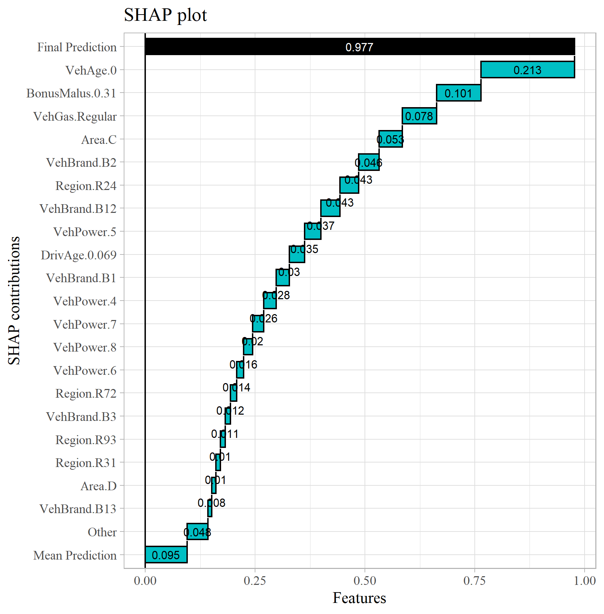
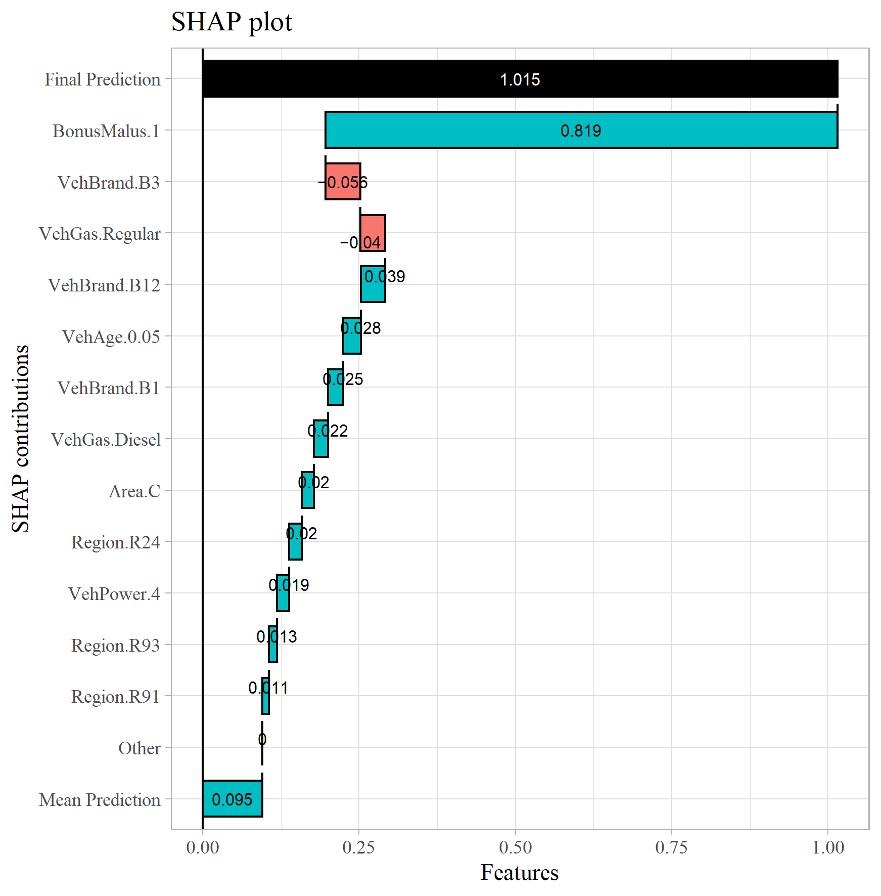
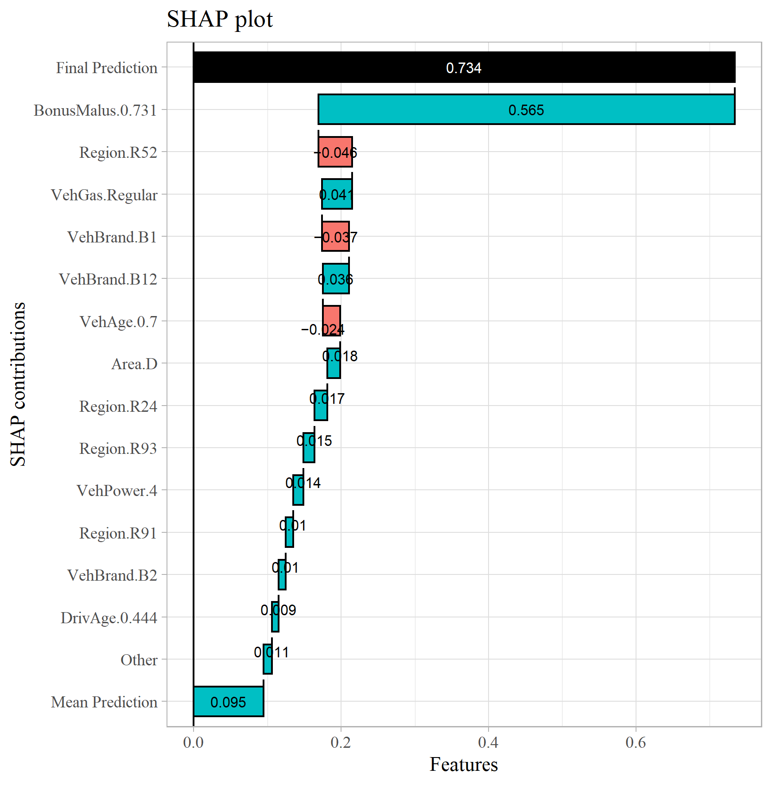
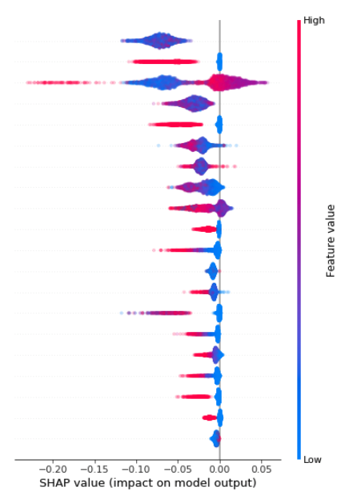

```{r, echo=FALSE, message=FALSE, warning=FALSE}

source("scripts/init.R")

# Load models and objects
Neural_Net = load_model_tf("models/Neural_Net")
load("models/eval_list.rda")
load("models/EDA.rda")


```

```{r, echo=FALSE}

# to be ran outside of code chunk
# Table of Contents
# [1. Intro to dataset](1. Intro to dataset)
# [1.1 Basic summary statistics](1.1 Basic summary statistics)
# 3. [Third Example](#third-example)

# Notes: Rebuild  XGB  using the same validation split. 


```


## Intro to case study

The aim of this document is to supply the reader of __[All Clear](https://www.theactuary.com/issues/2022/03/march-2022)__ in The Actuary Magazine, with a practical, comprehensive example of applying SHAP to explain models' predictions. \

The first section contains a short introduction to the dataset and EDA; in the next section I fit a Neural Network and a GLM (a tree based model will also be included soon for comparison); the third section contains output of SHAP and the final section holds additional technical information, with regards to both the used code and some mathematical background.   


## 1 The dataset

### 1.1 Source

The dataset can be downloaded from: [freMTPL2freq](https://www.kaggle.com/floser/french-motor-claims-datasets-fremtpl2freq) \

Originally it was accessible through [CASdatasets](http://cas.uqam.ca/pub/web/CASdatasets-manual.pdf) R package. Excerpt from the original documentation: \ 

**Description**

*In the two datasets freMTPL2freq, freMTPL2sev, risk features are collected for 677,991 motor third-part liability policies (observed mostly on one year). In addition, we have claim numbers by policy as well as the corresponding claim amounts. freMTPL2freq contains the risk features and the claim number while freMTPL2sev contains the claim amount and the corresponding policy ID.*

**Format**

**IDpol** The policy ID (used to link with the claims dataset). \
**ClaimNb** Number of claims during the exposure period. \
**Exposure** The period of exposure for a policy, in years. \
**VehPower** The power of the car (ordered values). \
**VehAge** The vehicle age, in years. \
**DrivAge** The driver age, in years (in France, people can drive a car at 18). \
**BonusMalus** Bonus/malus, between 50 and 350: <100 means bonus, >100 means malus in France. \
**VehBrand** The car brand (unknown categories). \
**VehGas** The car gas, Diesel or regular. \
**Area** The density value of the city community where the car driver lives in: from "A" for rural area to "F" for urban centre. \
**Density** The density of inhabitants (number of inhabitants per square-kilometer) of the city where the car driver lives in. \
**Region** The policy region in France (based on the 1970-2015 classification) 

\newpage

#### 1.2 Preprocessing and Basic summary statistics

```{r}

if(FALSE){
  data_input = read.csv2("data/freMTPL2freq.csv",sep = ",") %>% 
    as_tibble() %>%
    mutate(VehPower  = factor(VehPower, order = TRUE,levels = 4:15),
           across(c(Area,Region,VehBrand,VehGas),factor)) %>%
    rowwise() %>% 
    mutate(ClaimNb = as.integer(min(ClaimNb,4)),
           VehAge = as.integer(min(VehAge,20)),
           DrivAge = as.integer(min(DrivAge,90)),
           Exposure = as.numeric(min(Exposure,1)), 
           Density = log(Density)) %>% 
    ungroup()
}


```


```{r, echo=FALSE}

knitr::kable(EDA$head)

```


```{r, echo=FALSE}

# knitr::kable(EDA$skim)

```


```{r, echo=FALSE}

sample_TTS = sample(x = 1:nrow(data_input),size = round(0.85 * nrow(data_input)),replace = FALSE)

```

\newpage

### 1.3 EDA

```{r}

data_input %>% 
  group_by(DrivAge,Area) %>% 
  summarise(Freq = mean(ClaimNb),
            BonusMalus = mean(BonusMalus)) %>% 
  ggplot(aes(x = DrivAge, y=Freq, color = BonusMalus))+
  facet_wrap(~Area)+
  geom_point()+
  ggtitle("Claim frequency by driver age and region")+
  xlab("Driver Age")+
  ylab("")+
  theme_light()+
  theme(text=element_text(family="serif"),
        legend.justification = c("right", "top"))


```


\newpage

## 2. Models - fitting, output comparison
In this section we build three models - a Neural Network, Gradient Boosted Trees (XGBoost), and a Poisson GLM. 

We examine the models' outputs using a hold out test dataset (15% of available observations) and applying a model_evalulation function for additional statistics. The function lets us view: the obtained loss (MSE, MAE, Poisson Deviance); prediction statistics grouped by the actual claim number and raw predictions and more. Further details on model_evaluation function along with the source code can be found in section 4.1 \

Note:
Poisson deviance loss is not symmetrical around the actual value we compare the prediction against (in contrast to e.g. MSE and MAE). It puts more emphasis on differentiating between zero and non-zero claim instances than say observations with 1 and 2 claims (see 4.4 for additional information). 


### 2.1 NN

```{r}
# notrun
if(FALSE){
  
# don't enter next epoch if there are no significant performance gains 
early_stop = callback_early_stopping(monitor = "val_loss", patience = 3)

# Neural network structure
Neural_Net = keras_model_sequential(input_shape = c(ncol(train))) %>% 
  layer_dense(units = 64, activation = 'relu') %>%
  layer_dense(units = 64, activation = 'relu') %>%
  layer_dense(units = 32, activation = 'relu') %>%
  layer_dense(units = 1, activation = 'relu')

# Fitting the model
Neural_Net %>% 
  compile(
    loss = "poisson",
    optimizer = optimizer_rmsprop()
  ) %>% 
  fit(
    callbacks = list(early_stop),
    train %>% as.matrix(), 
    (data[sample_TTS,"ClaimNb"]/data_input$Exposure[sample_TTS]) %>% as.matrix(),
    batch_size = 2^13,
    epochs = 10,
    validation_split = 0.1,
    shuffle = TRUE ,
    sample_weight = data_input$Exposure[sample_TTS] %>% as.matrix() 
  )

eval_list$Neural_Net = model_evalulation(Neural_Net,
                                     cbind(test,data[-sample_TTS,"ClaimNb"]),
                                     type = "NN",
                                     ClaimNBadj = FALSE)
}

summary(Neural_Net)

```


\newpage

### 2.2 XGB
To be done

```{r, echo=FALSE}
# notrun
if(FALSE){
  
  XGB_validation = 1:10000
  
  dtrain = xgb.DMatrix(data = train[-XGB_validation,] %>% as.matrix(), 
                       label = data[sample_TTS,]$ClaimNb[-XGB_validation])
  
  dvalid = xgb.DMatrix(data = train[XGB_validation,] %>% as.matrix(), 
                       label = data[sample_TTS,]$ClaimNb[XGB_validation])
  
  watchlist <- list(train=dtrain, test=dvalid)
  
  m5_xgb <-
    xgboost(
      # data = data[sample_TTS,] %>% select(-ClaimNb) %>% ,
      # label = data[sample_TTS,]$ClaimNb ,
      
      # data = train[-XGB_validation,] %>% as.matrix() ,
      # label = data[sample_TTS,]$ClaimNb[-XGB_validation],
      data = dtrain,
      
      nrounds = 200,
      
      
      weight = (data[sample_TTS,"ClaimNb"]+1) %>% as.matrix(),
      objective = "reg:squarederror",
      early_stopping_rounds = 3,
      max_depth = 8,
      eta = .3,
      verbose = 2,
      watchlist = watchlist
    )  
  
# eval_list$xgb5 = model_evalulation(model = m5_xgb,
#                                    data = data.frame(test,
#                                                      ClaimNb = data[-sample_TTS,"ClaimNb"]),
#                                    type = "XGB")

}

```

\newpage

### 2.3 GLM

```{r, message=FALSE}

if(TRUE){
  
  GLM = glm(formula = ClaimNb/Exposure ~ Area + VehPower + VehAge + DrivAge + BonusMalus + VehBrand + VehGas + Density + Region,
            family = poisson(link = log),
            weights = Exposure,
            data = data_input[sample_TTS,] %>% select(-IDpol))  %>% suppressWarnings()
  
}

GLM

```

\newpage

### 2.4 Model comparison
Here we examine the model_evalulation outputs, starting with basic loss functions and then turning to more in-depth view and predictions statistics.

#### 2.4.1 Loss Metrics

Neural Network

```{r, echo=FALSE}
eval_list$Neural_Net$Evaluation
```

XGB

```{r, echo=FALSE}
# eval_list$XGB$Evaluation
```

GLM

```{r, echo=FALSE}
eval_list$GLM$Evaluation
```

#### 2.4.2 Broader summary statistics

As an alternative to comparing the loss metrics, we can assess the models performance using summary statistics grouped by the actual claim number. It can be noted that the average predictions for the Network are higher than for the GLM for policies with ClaimNb>0 and lower for ClamNb=0 which would suggest a better fit. Furthermore, the 

Neural Network

```{r, echo=FALSE}
eval_list$Neural_Net$AvE %>% select(-Negative_Pred,-IQR) %>% mutate_if(Negate(is.factor),round,digits=3)
```

XGB

```{r, echo=FALSE}
# eval_list$XGB$AvE %>% select(-Negative_Pred,-IQR) %>% mutate_if(Negate(is.factor),round,digits=3)
```

GLM

```{r, echo=FALSE}
eval_list$GLM$AvE %>% select(-Negative_Pred,-IQR) %>% mutate_if(Negate(is.factor),round,digits=3)
```

\newpage

## 3. XAI

Note that the current implementation of SHAP is insensitive to One-Hot Encoding, meaning that explanation of an instance might contain a non-zero contribution for both VehGas=Diesel AND VehGas!=Regular at the same time. This is caused by the lack of interface in the SHAP function to indicate the range of OHE variables. 

Currently to apply SHAP in  R, one has to access a Python environment that has SHAP package installed. Here, DALEX package is used as a wrapper for SHAP. Alternatively a work in progress version of a pure R implementation is available - shapr package v0.2.0 .

For the full code producing graphs below go to: scripts/Prep_SHAP_Graphs.R, where you will find a wrapper for the original plotting function, to allow for selecting only the most significant variables. It will prove helpful in case the models use a large number of variables and/or including OHE.


The code below is an example of how to call DALEX and SHAP in R. Here we estimate the SHAP values on a subset of 1000 observations. SHAP for the XGB and GLM are produced analogously.

```{r}

if(FALSE){
  explainer = list()
  residuals = list()
  SHAP = list()
  
  row_subset = sample(1:nrow(test),1000)
  
  explainer$Neural_Net = explain(
    model = Neural_Net,
    data = test[row_subset,],
    y = (data[-sample_TTS,"ClaimNb"] %>% as.matrix())[row_subset],
    predict_function = predict_wrapper,
    label = "Neural_Net"
  )
  
  SHAP$Neural_Net_1 = shap(explainer$Neural_Net, 
                           new_observation = test[678,],
                           method = "KernelSHAP"
  )
  
  SHAP$Neural_Net_1_plot = CustomSHAPplot(dalex_output = SHAP$Neural_Net_1)
}

```

\newpage

### 3.1 Individual SHAP


#### Neural Network
Individual SHAP value plots for observations:
with 1 claim and low error for NN; \
an instance with 0 claims and very high error \
An instance with 2 claims \

For this observation ClaimNb = 1, we can see (as in most cases) that the BonusMalus variable along with vehicle age and brand/gas type have the most impact on the final prediction.



\newpage

This instance, in reality has ClaimNb of 0 and Networks prediction for it, has the highest error from all observations with actual ClaimNb=0. Interestingly, if it wasn't for the BonusMalus value in case of this instance, the model could have output a much lower prediction. This could be confirmed using an ICE (Individual Conditional Expectation) plot for this observation.  



\newpage

In case of this observation, the actual number of claims=2, and here again BonusMalus plays a siginficant role in the final prediction.



\newpage

<!-- #### XGB -->
<!-- Individual SHAP value plots for observations: -->
<!-- * with 1 claim and low error for NN; -->
<!-- * an instance with 0 claims and very high error -->
<!-- * An instance with 2 claims  -->

<!--  -->

<!--  -->

<!--  -->


<!-- \newpage -->
<!-- #### GLM -->
<!-- For the GLM the contributions are going to be proportional directly to the obtained regression parameters, so SHAP plots here are not going to reveal anything that has not been implemented in the model by design. -->

<!-- To Do. -->

<!--  -->

<!--  -->

<!--  -->


### 3.2 Model - level SHAP

to be done 

placeholder:




[source](https://github.com/slundberg/shap/issues/553)

\newpage
## 4. Additional Information

### 4.1 model_evalulation utility function  

Utility function for analysing model performance. \

*Input:* \
model: KERAS Neural Network, XGBoost, GLM \
type: specify the type of model \
data: named dataframe to assess models' performance on \
ClaimNBadj: We might want to fit a model on transformed y h(y) which would require h^-1 transformation before obtianing comparable outputs

*Output:* \
list(Evaluation = Evaluation,
              Predictions = Predictions,
              AvE = AvE,
              Sorted_by_MSE = Sorted_by_MSE))


```{r}

if (FALSE){


  # utility function for analysing model performance
  model_evalulation = function(model,
                               data = test,
                               type = "NN",
                               ClaimNBadj = FALSE){
    if (type=="NN"){
      
      if( ClaimNBadj==TRUE){
        
        # rescaled Predictions 
        Predictions = data.frame(Predicted = (model %>% predict(data %>% select(-ClaimNb) %>% as.matrix()) %>% - 1),
                                 Actual = data$ClaimNb) 
      }else{
        
        Predictions = data.frame(Predicted = (model %>% predict(data %>% select(-ClaimNb) %>% as.matrix())),
                                 Actual = data$ClaimNb) 
      }
      
    }else if(type=="GLM"){
      
      Predictions = data.frame(Predicted = predict(model,newdata = data %>% select(-ClaimNb,-Exposure,-IDpol),type="response"), 
                               Actual = data$ClaimNb)
      
    }else if(type == "XGB"){
      
      Predictions = data.frame(Predicted = predict(model,newdata = data %>% select(-ClaimNb) %>% as.matrix()),
                               Actual = data$ClaimNb)
    }
    
    Evaluation = data.frame(
      absolute_error = mean(abs(as.matrix(Predictions$Predicted - data$ClaimNb))),
      mean_squared_error = mean(as.matrix((Predictions$Predicted - data$ClaimNb)^2)),
      ExposureWeightedPoissonDevianceLoss = ExposureWeightedPoissonDevianceLoss(Predictions$Predicted,data$ClaimNb)
    )
    
    
    AvE = Predictions %>% mutate(Actual = as.factor(Actual)) %>% 
      group_by(Actual) %>% 
      summarise(count = n(),
                mean_pred = mean(Predicted),
                sd_pred = sd(Predicted),
                min = min(Predicted),
                max = max(Predicted),
                Q1 = quantile(Predicted,probs = 0.25),
                Q2 = quantile(Predicted,probs = 0.5),
                Q3 = quantile(Predicted,probs = 0.75),
                IQR = (Q3-Q1)/Q2,
                Negative_Pred = sum(Predicted<0))
    
    
    Sorted_by_MSE = data %>% mutate(Predictions = Predictions$Predicted,
                                    SquaredError = (Predictions - ClaimNb)^2) %>% arrange(-SquaredError)
    
    return(list(Evaluation = Evaluation,
                Predictions = Predictions,
                AvE = AvE,
                Sorted_by_MSE = Sorted_by_MSE))
  }
  
  # for DALEX and SHAP explainer objects
  predict_wrapper=function(model,new_data){
    return(model %>% predict(new_data %>% as.matrix()))
  }
  
  predict_wrapper_GLM=function(model,new_data){
    return(predict(model,newdata = new_data,type="response"))
  }


  
}
```

### 4.2 
Data wrangling was not the main intention of this exercise, thus the dataset in Prep_RMD/XAI_data.rda has been already processed. The script below takes the raw freMTPL data as in the source and transforms it to our needs.

```{r}

if (FALSE){
  
  data_input=read.csv2("data/freMTPL2freq.csv",sep = ",") %>% 
    as_tibble() %>%
    mutate(VehPower  = factor(VehPower, order = TRUE,levels = 4:15),
           across(c(Area,Region,VehBrand,VehGas),factor)) %>%
    rowwise() %>% 
    mutate(ClaimNb = as.integer(min(ClaimNb,4)),
           VehAge = as.integer(min(VehAge,20)),
           DrivAge = as.integer(min(DrivAge,90)),
           Exposure = as.numeric(min(Exposure,1)), 
           Density = log(Density)) %>% 
    ungroup() 

  # remove ID's
  data = data_input %>% select(-c(IDpol,Exposure))
  
  # train/test split
  sample_TTS = sample(x = 1:nrow(data),size = round(0.85 * nrow(data)),replace = FALSE)
  
  train = data[sample_TTS,] %>% as.data.frame()
  test = data[-sample_TTS,] %>% as.data.frame()
  
  # Normalization of numeric variables
  data_prep = function(data){
    
    Normalized = apply(data %>% select(-ClaimNb) %>% select_if(Negate(is.factor)), 
                       2, 
                       FUN = function(x){return((x-min(x))/(max(x)-min(x)))}) %>% 
      as_tibble()
    
    data = data %>% select_if(is.factor) %>% cbind(Normalized)
    
    data$VehPower = factor(data$VehPower, order = FALSE)
    
    # OHE of factor variables
    OHE = dummyVars("~.", data = data %>% select_if(is.factor)) %>% 
      predict(newdata = data %>% select_if(is.factor)) %>% 
      as_tibble()
    
    data = data %>% select_if(Negate(is.factor)) %>% cbind(OHE) %>% as_tibble()
    
    return(data)
  }
  
  # data prep separately for train and test
  train = data_prep(train)
  test = data_prep(test)
  
}

```


### 4.3
text

```{r}

if (FALSE){
  
  # Customized and corrected SHAP plot
  CustomSHAPplot=function(dalex_output,
                          epsilon = 0.007){
    
    colnames(dalex_output) = str_replace_all(colnames(dalex_output),pattern = "_",replacement = "")
    
    # supply values in names for continuous variables
    dalex_output$vname[dalex_output$vname=="VehAge"]=paste("VehAge",round(dalex_output$VehAge[1],3),sep=".")
    dalex_output$vname[dalex_output$vname=="DrivAge"]=paste("DrivAge",round(dalex_output$DrivAge[1],3),sep=".")
    dalex_output$vname[dalex_output$vname=="BonusMalus"]=paste("BonusMalus",round(dalex_output$BonusMalus[1],3),sep=".")
    
    dalex_output = dalex_output %>% as_tibble()
    
    avg_pred = dalex_output$yhatmean
    total_pred = dalex_output$yhat
    other_pred = sum(dalex_output$attribution[abs(dalex_output$attribution)<=epsilon])
    
    plot_data = rbind(data.frame(values = c(avg_pred[1],other_pred),
                                 labels = c("Mean Prediction","Other")),
                      dalex_output %>% 
                        as_tibble() %>% 
                        filter(abs(attribution) > epsilon) %>% 
                        mutate(attribution = attribution) %>%
                        transmute(values = attribution,
                                  labels = vname) %>% 
                        arrange(abs(values))) %>% 
      mutate(values = round(values,3))
    
    plt = plot_data %>% 
      waterfall(fill_by_sign = TRUE,
                calc_total = TRUE,
                total_axis_text = "Final Prediction")+
      coord_flip()+
      ggtitle("SHAP plot")+
      xlab("SHAP contributions")+
      ylab("Features")+
      theme_light()+
      theme(text=element_text(family="serif"),
            legend.justification = c("right", "top"))
    
    return(plt)
  }
  
}

```

### 4.4 Poisson Deviance Loss

```{r}

ExposureWeightedPoissonDevianceLoss = function(predicted,
                                               actual,
                                               exposure=NULL){
  
  output = rep(NA,length(actual))
  
  if (is.null(exposure)){
    exposure = rep(1,length(actual))
  }
  
  # actual zero 
  k = (actual == 0)
  output[k] = 2*predicted[k]*exposure[k]
  
  # actual non zero and predicted non-zero
  m = (actual != 0 & predicted != 0 )
  output[m] = 2*actual[m]*(predicted[m]*exposure[m]/actual[m] - 1 - log(predicted[m]*exposure[m]/actual[m]))
  
  # actual non-zero and predicted zero
  n =  (actual != 0 & predicted == 0 )
  output[n] = 2*actual[n]
  
  output = sum(output)
  
  return(output)
}

```


```{r, echo=FALSE}

data.frame(predicted = 0:50,
           actual = 20) %>% 
  mutate(PDL = actual*log(actual / predicted) - (actual - predicted)) %>% 
  ggplot(aes(x = predicted, y = PDL))+
  geom_line(size = 1)+
  ggtitle("Poisson Deviance Loss function",
          subtitle = "20 - actual observation")+
  xlab("Model Prediction")+
  ylab("Poisson Deviance Loss")+
  theme_light()+
  theme(text=element_text(family="serif"),
        legend.justification = c("right", "top"))


```

### 4.5 Session  information
Hardware, R and Python configuration 

```{r}

sessionInfo()

```

Py:
version: 3.8.5 (default, Sep 3 2020, 21:29:08) [MSC v.1916 64 bit (AMD64)]
Architecture: 64bit
numpy_version: 1.19.2